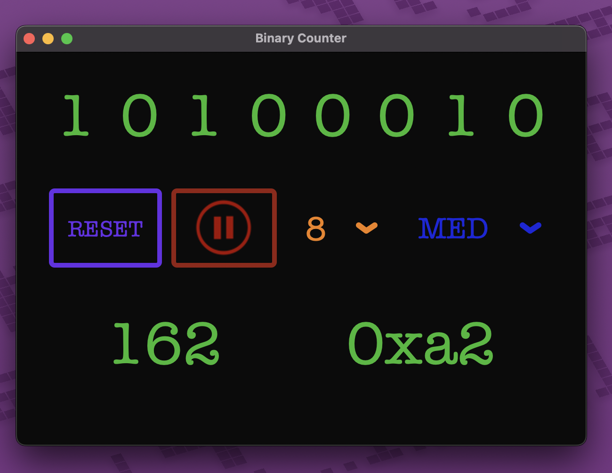

# binary-counter
A customtkinter GUI for a counter in binary!
Use this app to demonstrate the relationship between binary numbers, decimal 
numbers, and hexadecimal numbers. There are adjustable speeds, adjustable 
number of bits, a reset button, and a pause/play button.